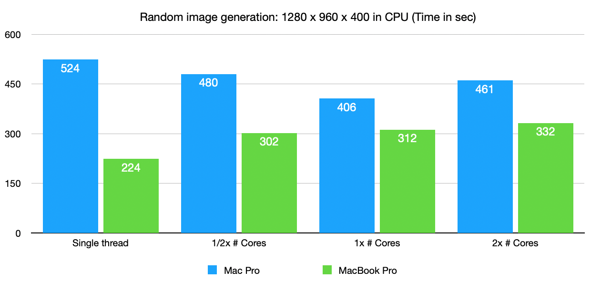
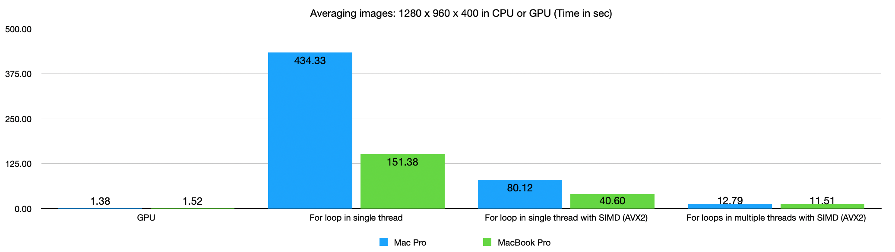

# CPU vs GPU in Mac Pro (2013) & MacBook Pro (2018)

Comparison between Intel CPU and AMD GPU.  At CPU side, the software utilizes all the cores by multi-threading, and each core calculates 8 scalars at once using the AVX2 command set.

The comparison ran on Mac Pro (2013) and MacBook Pro (2018).  The specifications of the systems are as follows.

Time taken to generate 400 random images with 1280 x 960 resolution:

Note that the performance in the Mac Pro decreases w.r.t. the number of threads, but the MacBook Pro shows an opposite tendency.  Profiling is required to understand this result.

Time taken to average the 400 images with 1280 x 960 resolution:

The image averaging is an essential calibration necessary to get dark current calibration parameters for image sensors.

## Generation of Random Images: 400 images with 1280 x 960 resolution

### Mac Pro (2013): 3GHz 8-Core Xeon E5

16 threads: 461 seconds

8 threads: 406 seconds

4 threads: 480 seconds

1 thread: 524 seconds

### MacBook Pro (2018): 2.9GHz 6-Core Intel Core i9

12 threads: 332 seconds

6 threads: 312 seconds

3 threads: 302 seconds

1 thread: 224 seconds

## Averaging Images: 400 images with 1280 x 960 resolution

### Mac Pro (2013): 3GHz 8-Core Xeon E5

#### Compute Way

Averaging 400 images (1280 x 960) in compute way: 1.37634 seconds

#### Basic For Loop Way

Averaging 400 images (1280 x 960) in basic for-loop way: 434.32800 seconds

#### For Loop Way (with SIMD)

Averaging 400 images (1280 x 960) in SIMD for-loop way: 80.11892 seconds

#### Multi-Threaded For Loop Way (with SIMD)

Averaging 400 images (1280 x 960) in multi-threaded SIMD for-loop way: 12.79146 seconds

### MacBook Pro (2018): 2.9GHz 6-Core Intel Core i9

#### Compute Way

Averaging 400 images (1280 x 960) in compute way: 1.52347 seconds

#### Basic For Loop Way

Averaging 400 images (1280 x 960) in basic for-loop way: 151.38189 seconds

#### For Loop Way (with SIMD)

Averaging 400 images (1280 x 960) in SIMD for-loop way: 40.60287 seconds

#### Multi-Threaded For Loop Way (with SIMD)

Averaging 400 images (1280 x 960) in multi-threaded SIMD for-loop way: 11.51005 seconds