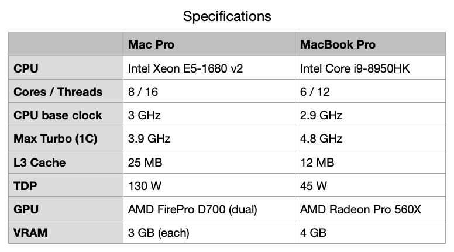

# CPU vs GPU in Mac Pro (2013) & MacBook Pro (2018)

Multi-threading으로 CPU의 모든 core들을 활용했고, 각 core에서도 AVX2 명령어를 이용해서 scalar 값 8개씩을 한꺼번에 계산하도록 프로그램을 수정했다.

게다가 기왕 비교하는 김에 Mac Pro (2013)과 MacBook Pro (2018)의 성능도 비교해봤다. 좀 더 객관적인 비교를 위해서는 여러 조건에서 여러 문제들을 계산해보고 종합적으로 비교해야겠지만, 어디까지나 심심풀이 땅콩이고 Apple Silicon을 탑재한 Mac으로 넘어가기 위한 근거를 확보하기 위함이라... 

두 하드웨어의 사양 비교:

Mac Pro가 크게 불리하지 않을 듯 보이겠지만 Mac Pro는 2013년 제품, MacBook Pro는 2018년 제품이다.

아무리 인텔이 일 안하고 놀며 먹은지 오래지만 제자리 걸음은 아니었음에 유의.

1280 x 960 해상도의 랜덤 이미지 400장 생성에 필요한 시간:

Thread 갯수에 대한 전체 연산 시간의 경향이 서로 반대로 나타난 이 결과는 아직 잘 해석이 안된다.  

Mac Pro는 core 갯수만큼 thread를 늘렸을 때 미미하나마 성능 향상이 있었지만, MacBook Pro는 오히려 반대의 경향을 보였다. 난수를 발생시키는 라이브러리의 함수 하나를 호출한 다음 그 값을 메모리에 기록하는 연산의 특성 때문이 아닌가 추측한다. 메모리에 접근하는 시스템 버스의 속도, 데이터 전송 폭과 각 core의 성능, 서로 다른 thread에서 동일한 라이브러리 함수를 호출할 때 그 안에서 어떻게 처리하는지 등등이 모두 엮여 있다.  

각 thread에서 난수를 발생시키는데 많은 시간이 소요되지 않지만 데이터 전송 대역폭이 제한적이라 각각의 thread에서 메모리 기록을 대기하는 시간이 길다면 thread 갯수를 늘려도 큰 도움이 안 될 것이다. 반대로 각 thread에서 난수 발생에 적절한 시간이 소요되고, 모든 thread에서 난수를 메모리에 기록하는데 필요한 대역폭과 잘 맞아 떨어진다면, thread 갯수를 늘리는 방법이 성능 향상을 가져올 것이다.  

각 thread가 어떤 일이 많은 시간을 소모했는지 profiling을 해본 후에야 이 결과를 제대로 해석할 수 있겠다.

이번에는 1280 x 960 해상도 이미지 400장의 산술평균을 계산하는데 필요한 시간:

무엇 때문에 이미지를 평균하고 있냐? 그걸 무엇에 쓰게? 라는 질문이 나올 듯 한데, 이는 이미지 센서의 offset 보정을 위해 필요한 연산임을 먼저 밝혀 둔다.

내가 하는 CT image reconstruction에서도 필수적인 보정 연산이다.

이 연산은 어떤 라이브러리도 호출하지 않고 내가 작성한 코드가 거의 그대로 CPU나 GPU에서 실행된다. 4-byte single precision 부동소수의 덧셈에 필요한 시간과 메모리/캐쉬 대역폭 사이의 균형이 얼마나 잘 맞느냐가 영향을 줄텐데, 대략 예상하던 경향의 결과다. 단, AVX2 SIMD 명령어로 한 번에 8개씩 연산한다고 반드시 8배의 성능이 향상되지는 않는다. 덧셈 연산이 단순하기 때문에 memory에서 SIMD 레지스터로 8개씩 데이터를 불러들이는 오버헤드가 상대적으로 작지 않다. 대략 3.8 - 5.4배 정도의 차이가 난다. 비슷한 이유로 thread 갯수를 6개-8개로 늘렸지만 산술적으로 그와 동일한 배수의 성능 향상은 없다.  

어쨌거나, 나름 CPU의 활용도를 최대한 끌어 올렸지만 여전히 GPU 연산 성능에 비해 7.6 - 9.3배 정도 느리다.

## Generation of Random Images: 400 images with 1280 x 960 resolution

### Mac Pro (2013): 3GHz 8-Core Xeon E5

16 threads: 461 seconds

8 threads: 406 seconds

4 threads: 480 seconds

1 thread: 524 seconds

### MacBook Pro (2018): 2.9GHz 6-Core Intel Core i9

12 threads: 332 seconds

6 threads: 312 seconds

3 threads: 302 seconds

1 thread: 224 seconds

## Averaging Images: 400 images with 1280 x 960 resolution

### Mac Pro (2013): 3GHz 8-Core Xeon E5

#### Compute Way

Averaging 400 images (1280 x 960) in compute way: 1.37634 seconds

#### Basic For Loop Way

Averaging 400 images (1280 x 960) in basic for-loop way: 434.32800 seconds

#### For Loop Way (with SIMD)

Averaging 400 images (1280 x 960) in SIMD for-loop way: 80.11892 seconds

#### Multi-Threaded For Loop Way (with SIMD)

Averaging 400 images (1280 x 960) in multi-threaded SIMD for-loop way: 12.79146 seconds

### MacBook Pro (2018): 2.9GHz 6-Core Intel Core i9

#### Compute Way

Averaging 400 images (1280 x 960) in compute way: 1.52347 seconds

#### Basic For Loop Way

Averaging 400 images (1280 x 960) in basic for-loop way: 151.38189 seconds

#### For Loop Way (with SIMD)

Averaging 400 images (1280 x 960) in SIMD for-loop way: 40.60287 seconds

#### Multi-Threaded For Loop Way (with SIMD)

Averaging 400 images (1280 x 960) in multi-threaded SIMD for-loop way: 11.51005 seconds